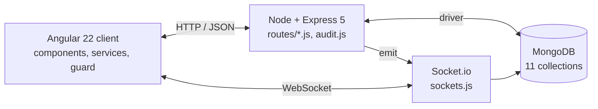

# Phase 2 Documentation – Fabulari Chat System

**3813ICT Full Stack Development**

**Name:** Hadi Alkhub  
**Student Number:** s5331680  
**Workshop Time:** Wednesday 3pm  
**GitHub Repository:** [https://github.com/HadiAlk4/Chat-App-System](https://github.com/HadiAlk4/Chat-App-System)  
**Date:** October 2026

## Overview

Fabulari is a MEAN-stack chat application: MongoDB (native Node driver), Express 5, Angular 22 (standalone components, PaperCSS) and Node.js, with Socket.io for real-time chat and live request queues. Users chat in rooms that belong to groups. Three roles, Super Admin, Group Admin (GA) and User, control what each person can see and do. Phase 1 kept most data in a JSON file or in mock arrays. In Phase 2 every screen reads and writes MongoDB through the API.

**Running it:** start MongoDB on `localhost:27017`; `cd backend && npm start` (port 3000); `cd frontend && npm start` (port 4200).

## Specifications and Requirements

Requirements come from the brief, the client meeting (Week 2) and the published clarifications. Status reflects the code on `main`.

| **Area** | **Requirement** | **Status** |
|---|---|---|
| Stack | MEAN stack. MongoDB replaces `fakeData.json`. Socket.io handles real-time events. | Done |
| Auth | Basic email and password login. Passwords are hashed with bcrypt. OAuth is not used. | Done |
| Password rule | At least 8 characters, alphanumeric only, at least one uppercase letter. Checked on signup and password change. | Done |
| Bootstrap | The first account registered becomes the only Super Admin. Signup shows a note when the database has no users. | Done |
| Super Admin | Handles requests only. Cannot chat, read chat history, join or propose groups. Creates a group only by approving a user proposal, and the proposer becomes the first GA. Cannot delete or ban themselves. | Done |
| Global ban | Approving an account deletion removes the user and all their messages, and adds their email to a permanent ban list. Banned emails cannot log in or register again. | Done |
| Audit log | Every Super Admin decision is stored with a timestamp. A dedicated page filters by action type and date range. | Done |
| Groups | Unique group names. Any user can view all groups and request to join. No limit on how many groups a user joins or administers. | Done |
| Age limit | Min age applies to every room in the group. Users under it cannot request to join. Raising it removes members who are too young, but cannot remove the last GA. | Done |
| GA settings | Edit name, description (≤250 chars), min age and theme without Super Admin approval. A confirm dialog lists the changes first. | Done |
| Rooms | GA creates, renames and deletes rooms. Users propose rooms and the GA approves or rejects them. Zero to unlimited rooms per group. | Done |
| Members | GA can promote members to GA. A group always keeps at least one GA. GA sees the allowed and banned member lists. | Done |
| Group bans | Bans are permanent and there is no un-ban. Users can ask a GA to ban someone. A ban on a GA goes to the Super Admin instead. | Done |
| Step down | A GA cannot step down if they are the only GA or have pending Super Admin requests. | Done |
| Group deletion | A GA requests deletion and the Super Admin approves it. The group and its data are removed, and the GA is demoted if they administer no other group. | Done |
| Requests | Rejections need a reason. Pending requests cannot be cancelled. Users see pending and rejected requests in Request History. | Done |
| Messaging | Single-channel, single-thread. Text plus PNG, JPEG and GIF images up to 2 MB. No external links. Shows sender name and timestamp. Users can delete their own messages. | Done |
| History | Only the last 5 messages are loaded when entering a room. Live messages are not capped while the user stays. A new room starts blank. | Done |
| Real-time | Join and leave toasts (closable with X), live participant sidebar, GA badge in the sidebar, and a toast when a join request is accepted or denied. | Done |
| Cascade delete | When an account deletion is approved, that user's messages disappear from every open chat straight away. | Done |
| Theme | The group's theme (light/dark) applies to its chat rooms. A user can override it with a personal theme that applies across all groups. | Done |
| Profile | Username (changeable), email (fixed, unique ID), password change with current password, DOB/age, role, profile picture (≤2 MB), memberships. Profiles are private. | Done |
| Responsive | Desktop first and usable at tablet width (PaperCSS grid). | Done |
| HTTPS | Messages served over HTTPS. | Not done |

**Known limitations.** The server runs on HTTP. The API trusts the username sent by the client and has no session token, so role checks happen in the Angular guard and in selected routes. The upload filter also accepts WebP, which the spec does not list.

## Server-side API

Base URL `http://localhost:3000`. Bodies are JSON (uploads use `multipart/form-data`). Most responses have the form `{ ok, message, ...data }`. Validation failures return `ok:false` with a 400, 403 or 404 status. Server errors return 500. `GET` list endpoints return an array.

### REST endpoints

| **Method** | **Endpoint** | **Input** | **Behaviour** |
|---|---|---|---|
| **Authentication and users** |  |  |  |
| POST | `/api/auth` | email, password | bcrypt compare. Blocks banned emails. Returns the user without the password. |
| GET | `/api/signup/first-user` | – | `{ firstUser }`. True when no users exist yet. |
| POST | `/api/signup` | username, email, password, dob, age | Checks the password rule, the ban list and duplicate emails. The first user becomes `super-admin`. |
| PATCH | `/api/users/username` | email, newUsername | Must be unique. Renames the user in groups, messages and requests. |
| PATCH | `/api/users/password` | email, currentPassword, newPassword | Checks the current password, then applies the rule and stores the new hash. |
| PATCH | `/api/users/theme` | email, isDarkMode, usePersonalTheme | Saves the personal chat theme override. |
| **Groups, rooms and members** |  |  |  |
| GET | `/api/groups` | – | All groups. |
| GET | `/api/groups/user/:username` | – | Groups where the user is a member or admin. |
| GET | `/api/groups/:groupName` | – | One group, 404 if missing. |
| PATCH | `/api/groups/:groupName` | groupName, groupDescription, minAge, themeColor, username | GA only (403 otherwise). Unique name, description ≤250 chars. Removes members under the new min age. A rename updates every collection. |
| POST | `/api/groups/:groupName/leave` | username | Leave the group. The only GA cannot leave. |
| POST | `/api/groups/:groupName/rooms/direct` | roomName | GA adds a room. Names are unique within the group, ignoring case. |
| PATCH | `/api/groups/:groupName/rooms/rename` | oldName, newName | Rename a room. |
| DELETE | `/api/groups/:groupName/rooms/:roomName` | – | Delete a room. |
| POST | `/api/rooms` | groupName, roomName | Older direct add from Phase 1. |
| PATCH | `/api/groups/:g/members/:u/promote` | – | Add the member to `admins`. |
| POST | `/api/groups/:g/members/:u/remove` | – | Remove the member. The only GA cannot be removed. |
| POST | `/api/groups/:g/members/:u/ban` | – | Permanent group ban (`bannedMembers`). The only GA cannot be banned. |
| POST | `/api/groups/:g/admins/:u/step-down` | – | Blocked if they are the only GA or have pending Super Admin requests. Demotes their role if they administer no other group. |
| **Request queues (each has create, list, approve, reject; reject needs `reason`)** |  |  |  |
| POST, GET | `/api/group-requests` | groupName, description, minAge, themeColor, creator | Group proposal to the Super Admin. The name must be free. The Super Admin cannot propose. |
| PATCH | `/api/group-requests/:id/approve\\|reject` | performedBy, reason | Approve creates the group with a `Main Room` and the proposer as GA. Both are audited. |
| POST, GET | `/api/join-requests` | groupName, username | Checks age, ban and duplicate requests. The Super Admin cannot join. |
| PATCH | `/api/join-requests/:id/approve\\|reject` | reason | Approve adds the user to `members`. |
| POST, GET | `/api/room-requests` | groupName, roomName, username | Members only. The room name must be free. |
| PATCH | `/api/room-requests/:id/approve\\|reject` | reason | Approve adds the room. |
| POST, GET | `/api/group-ban-requests` | groupName, targetUsername, requestedBy | Routed to the GA, or to the Super Admin if the target is a GA. Filter with `destination`. |
| PATCH | `/api/group-ban-requests/:id/approve\\|reject` | reason | Approve applies the permanent group ban. |
| POST, GET | `/api/group-deletion-requests` | groupName, requestedBy, reason | GA only. One pending request per group. |
| PATCH | `/api/group-deletion-requests/:id/approve\\|reject` | performedBy, reason | Approve deletes the group, its messages and its requests, and demotes the GA. Audited. |
| POST, GET | `/api/account-deletion-requests` | username | The user asks to delete their account. Not allowed for the Super Admin. |
| PATCH | `/api/account-deletion-requests/:id/approve\\|reject` | performedBy, reason | Approve deletes the user and their messages and bans the email. Audited as a global ban. |
| GET | `/api/banned-emails` | – | Permanently banned emails, newest first. |
| **Chat, uploads and audit** |  |  |  |
| GET | `/api/messages/:groupName/:roomName` | query: username | Last 5 messages, oldest first. Returns 403 for the Super Admin. |
| DELETE | `/api/messages/:id` | – | Delete a message. |
| POST | `/api/upload/avatar` | form: image, username | Image ≤2 MB. Sets `profilePictureUrl`. |
| POST | `/api/upload/chat` | form: image | Image ≤2 MB. Returns `fileUrl` (served from `/uploads`). |
| GET | `/api/audit-logs` | query: action, startDate, endDate | Filtered audit log, newest first. |

### Socket.io events

Room channels are named `groupName:roomName`. The server ignores chat events from unknown users and from the Super Admin, and drops messages that contain `http(s)://` or `www.`.

| **Direction** | **Event** | **Payload and effect** |
|---|---|---|
| client→server | `join-room`, `leave-room` | `{groupName, roomName, username}`. Joins or leaves the channel and updates who is present. |
| client→server | `send-message` | `{groupName, roomName, senderUserName, content, imageUrl}`. Saves to `messages`, then broadcasts it. |
| client→server | `delete-message` | `{groupName, roomName, messageId}`. Deletes from MongoDB, then broadcasts. |
| server→room | `new-message`, `message-deleted` | The saved message, or `{messageId}`. |
| server→room | `user-joined`, `user-left`, `room-users` | Trigger toasts and the live participant list. |
| server→all | `<queue>-created`, `<queue>-resolved` | For group, join, room, group-ban, group-deletion and account-deletion requests. Queues and Request History refresh live. `join-request-resolved` triggers the accept/deny toast. `account-deletion-request-resolved` removes the deleted user's messages from open chats. |

## Angular Architecture

Standalone components with routing in `app.routes.ts`. The logged-in user is kept in `sessionStorage`, so each browser tab has its own login. `authGuard` protects every route except login and signup. It checks `expectedRole` for Super Admin pages and sends a Super Admin away from `chat`, `my-memberships` and `group-settings`.

### Components

| **Component** | **Route** | **Responsibility** |
|---|---|---|
| `Login` | `/login` | Posts credentials to `/api/auth`, stores the user, and routes by role (Super Admin dashboard or dashboard). Shows API errors, including the banned message. |
| `Signup` | `/signup` | Registration with age from DOB and an optional profile doodle. Shows a note when the next account will be the Super Admin. |
| `Dashboard` | `/dashboard` | Lists and searches groups, proposes a group (modal), and requests to join. Groups the user is already in are hidden. Both actions are hidden for the Super Admin. |
| `MyMemberships` | `/my-memberships` | The user's groups, filtered by name and role. Opens chat, settings, or leave. |
| `GroupSettings` | `/group-settings` | GA-only tabs. *General*: edit and save with a confirm dialog. *Rooms*: add, rename, delete. *Members*: promote, ban, banned list. *Requests*: join, room and ban queues. Also step down and request deletion. Updates live over sockets. |
| `RequestHistory` | `/request-history` | The user's pending and rejected requests with reasons. Tabs to propose a room and to request a ban. |
| `Chat` | `/chat` | Room list, last-5 history plus live messages, image attachments, delete own message, toasts, participant sidebar with GA badge, and the group or personal theme. |
| `UserProfileSettings` | `/user-profile-settings` | Change username, password and theme. Upload a profile picture. Request account deletion. |
| `SuperAdminDashboard` | `/super-admin-dashboard` | Live queues for group proposals, GA ban requests, group deletions and account deletions, plus the banned-email list. Every rejection needs a reason. |
| `SuperAdminAuditLog` | `/super-admin-audit-log` | Audit table filtered by action type and date range. |

### Services

- `AuthService`: get, set and clear the session user; logout.
- `GroupService`: all group, room and member endpoints, plus every request queue (group, join, room, ban, deletion).
- `ChatService`: room history over HTTP. Emits and listens to chat socket events (`join-room`, `send-message`, `new-message`, `room-users`, and so on).
- `SocketService`: typed observables for every `*-created` and `*-resolved` request event.
- `AccountService`: account deletion requests, banned emails, and username, password and theme updates.
- `UploadService`: avatar and chat image uploads (`FormData`).
- `AuditService`: audit log query with filters.

### Models (TypeScript interfaces)

`Group`, `GroupRequest`, `JoinRequest`, `RoomRequest`, `GroupBanRequest`, `GroupDeletionRequest`, `AccountDeletionRequest`, `BannedEmail`, `AuditLog`, `ChatMessage`. They mirror the MongoDB documents in Section [Data structures](#data-structures-mongodb-collections). Request models share a `status` of `pending`, `approved` or `rejected`, plus `createdAt`, `reviewedAt` and `rejectionReason`.

## Design Documents

### System architecture

`app.js` builds the Express app (`createApp(io)`). `index.js` attaches the HTTP server and Socket.io. Because of this split, tests can import the app without starting a server, using a stub `io`. Business rules are pulled out into small, pure helpers in `backend/lib/` (password policy, age check, link check, last-5 window).

### Data structures (MongoDB collections)

| **Collection** | **Fields** |
|---|---|
| `users` | username, email (unique ID), password (bcrypt), dob, age, role (`super-admin`\|`group-admin`\|`user`), valid, isDarkMode, usePersonalTheme, profilePictureUrl |
| `groups` | groupName (unique), groupDescription, minAge, themeColor (`light`\|`dark`), admins[], members[], rooms[], bannedMembers[] |
| `messages` | groupName, roomName, senderUserName, content, imageUrl, timestamp |
| `groupRequests` | groupName, groupDescription, minAge, themeColor, creatorUserName, creatorEmail + request fields |
| `joinRequests` | groupName, username + request fields |
| `roomRequests` | groupName, roomName, username + request fields |
| `groupBanRequests` | groupName, targetUsername, targetEmail, targetRole, requestedBy, requestedByRole, destination (`group-admin`\|`super-admin`) + request fields |
| `groupDeletionRequests` | groupName, requestedBy, requestedByRole, reason + request fields |
| `accountDeletionRequests` | username, email, role + request fields |
| `bannedEmails` | email, username, bannedAt, reason |
| `auditLogs` | timeStamp, actionPerformed, target, performedBy (insert only) |

*Request fields* are status, createdAt, reviewedAt and rejectionReason. Groups store room names and usernames as arrays instead of references, so a single read loads a whole group. When a user or group is renamed, the server updates the name in every collection.

## Testing

### Tools and methodology

- **Backend unit tests**, Mocha with Node `assert` (`npm run unitTest`). Test the pure helpers in `backend/lib`.
- **Backend integration tests**, Mocha, Chai and chai-http (`npm test`). Each test calls `createApp()` against a separate `chat-app-test` database. The database is wiped before and after every test, so no test depends on another. Each endpoint has at least one success case and one failure case.
- **Angular unit tests**, Vitest with TestBed via `ng test`. Services are replaced with test doubles, so components are tested without a backend.
- **End-to-end tests**, Cypress (`npm run cypress:run`), against the real frontend and a backend started with `MONGO_DB_NAME=chat-app-test`. A `resetDb` task drops the test database before each spec.

Before any tests were written, the logic was moved into testable helpers and the app setup was split from `listen()`. The end-to-end tests found four screens that did not refresh after data loaded (login errors, dashboard, memberships, chat), and these were fixed.

**Results (run 1 Oct 2026):** all 150 automated tests pass: backend unit 14/14, backend integration 100/100, Angular 27/27 and Cypress 9/9. The full output of each run is in Section [Test run output](#test-run-output).

### Automated tests

| **Suite** | **Target** | **#** | **Cases** |
|---|---|---|---|
| Unit | `isValidPassword` | 4 | accepts valid; rejects too short, no uppercase, symbol |
| Unit | `isUnderMinAge` | 3 | under min; equal to min; missing age not treated as under |
| Unit | `containsExternalLink` | 3 | detects http, www; allows plain text |
| Unit | `latestMessagesOldestFirst` | 4 | keeps latest 5; exactly 5; fewer than 5; oldest-first order |
| Integration | `/api/auth`, `/api/signup` | 6 | valid login; wrong password; banned login; first user is Super Admin; weak password; banned email signup |
| Integration | `/api/users/*` | 6 | rename; missing name; change password; wrong current password; save theme; missing theme flags |
| Integration | `/api/groups*` | 11 | list all / empty; user groups / none; get one / 404; leave / missing username; save settings and remove under-age members; missing description; non-GA 403 |
| Integration | rooms | 8 | add / missing name; rename / missing new name; delete / 404; `POST /api/rooms` add / unknown group |
| Integration | members | 8 | promote / 404; remove / only GA; ban / 404; step down / only GA |
| Integration | group requests | 8 | create / missing fields; list / empty filter; approve creates group with GA / not pending; reject with reason / no reason |
| Integration | join requests | 8 | create / under age; list / empty filter; approve adds member / not pending; reject with reason / no reason |
| Integration | room requests | 8 | create / missing fields; list / empty filter; approve adds room / not pending; reject with reason / no reason |
| Integration | group ban requests | 8 | create / missing fields; list by destination / empty; approve bans / 404; reject with reason / no reason |
| Integration | group deletion | 8 | create / missing reason; list / empty; approve deletes and demotes / 404; reject with reason / no reason |
| Integration | account deletion, banned emails | 10 | create / Super Admin blocked; list / empty; approve deletes and bans / 404; reject with reason / no reason; banned list / empty |
| Integration | `/api/messages` | 5 | last 5 oldest first; missing username 400; Super Admin 403; delete / 404 |
| Integration | `/api/upload/*` | 4 | avatar PNG / no file; chat PNG / no file |
| Integration | `/api/audit-logs` | 2 | returns logs; filters by action |
| Angular | `App` | 2 | creates root; renders router outlet |
| Angular | `authGuard` | 3 | logged out to login; user blocked from Super Admin page; Super Admin blocked from chat |
| Angular | `Login` | 3 | empty fields no HTTP; user to dashboard; Super Admin to Super Admin dashboard |
| Angular | `Signup` | 4 | age for past, empty and future DOB; empty form not posted |
| Angular | `Dashboard` | 2 | proposal sent via service; joined groups hidden |
| Angular | `Chat` | 3 | link not sent; plain text sent; history shows sender name |
| Angular | `GroupSettings` | 4 | form filled from group; confirm before raising min age; rejection needs reason; non-GA redirected |
| Angular | `RequestHistory`, `MyMemberships` | 2 | renders a join request; renders a membership |
| Angular | `SuperAdminDashboard` | 1 | renders pending proposals |
| Angular | `SuperAdminAuditLog` | 2 | renders logs; applies action and date filters |
| Angular | `UserProfileSettings` | 1 | shows error on wrong current password |
| E2E | `login.cy.ts` | 3 | logs in and fills dashboard; sends credentials to API; error on empty submit |
| E2E | `access.cy.ts` | 3 | logged-out redirect; logged-in reaches dashboard; bad credentials stay on login |
| E2E | `admin-group.cy.ts` | 1 | after Super Admin approval the group leaves the creator's join list and appears in My Memberships |
| E2E | `chat.cy.ts` | 2 | two users: other member's message shows their name; link message not shown |

### Test run output

Output from the four test commands, pasted as printed. Colour codes, Node/npm warnings and a Cypress start-up warning about clearing old screenshots are removed, and tick, cross and box-drawing characters are replaced with ASCII so the PDF font can display them.

#### Backend unit tests (`cd backend && npm run unitTest`)

    > chat-app-system@1.0.0 unitTest
    > mocha unitTest

      isUnderMinAge
        under the minimum
          ok returns true when the age is below the group minimum
        equal to the minimum
          ok returns false when the age matches the group minimum
        missing age
          ok does not treat a missing age as under the minimum

      containsExternalLink
        http link
          ok detects an http URL
        www link
          ok detects a www host
        plain text
          ok allows text that is not a link

      latestMessagesOldestFirst
        more than five
          ok keeps only the latest five messages
        exactly five
          ok returns all five messages
        fewer than five
          ok returns every message when the room has fewer than five
        oldest-first order
          ok returns the window with the oldest message first

      isValidPassword
        valid password
          ok accepts 8 alphanumeric characters with an uppercase letter
        too short
          ok rejects a password shorter than 8 characters
        missing uppercase
          ok rejects a long password with no uppercase letter
        symbol rejected
          ok rejects a password that contains a symbol

      14 passing (6ms)

#### Backend integration tests (`cd backend && npm test`)

    > chat-app-system@1.0.0 test
    > MONGO_DB_NAME=chat-app-test mocha --require ./integrationTest/hooks.js --timeout 20000 "integrationTest/*.test.js"

      account deletion routes
        POST /api/account-deletion-requests
          ok queues a deletion request (46ms)
          ok rejects a super admin deletion request
        GET /api/account-deletion-requests
          ok returns pending requests
          ok returns an empty list when the status filter matches nothing
        PATCH /api/account-deletion-requests/:id/approve
          ok deletes the user and bans the email
          ok returns 404 when the request is not pending
        PATCH /api/account-deletion-requests/:id/reject
          ok stores the rejection reason
          ok rejects a decision that has no reason
        GET /api/banned-emails
          ok returns banned emails
          ok returns an empty list when nobody is banned

      audit routes
        GET /api/audit-logs
          ok returns stored audit logs
          ok filters logs by action type

      auth routes
        POST /api/auth
          ok logs in with a valid email and password
          ok rejects a wrong password
          ok tells a permanently banned account it cannot log in
        POST /api/signup
          ok creates the first account as super admin (102ms)
          ok rejects a password without an uppercase letter
          ok rejects a permanently banned email

      chat routes
        GET /api/messages/:groupName/:roomName
          ok returns the latest five messages oldest first
          ok rejects a history request with no username
          ok forbids a super admin from reading chat history
        DELETE /api/messages/:id
          ok deletes a stored message
          ok returns 404 when the message does not exist

      group ban request routes
        POST /api/group-ban-requests
          ok queues a ban request against another member
          ok rejects a request that is missing fields
        GET /api/group-ban-requests
          ok returns pending requests for a destination
          ok returns an empty list when the destination filter matches nothing
        PATCH /api/group-ban-requests/:id/approve
          ok bans the target member (41ms)
          ok returns 404 when the request is not pending
        PATCH /api/group-ban-requests/:id/reject
          ok stores the rejection reason
          ok rejects a decision that has no reason

      group deletion routes
        POST /api/group-deletion-requests
          ok queues a deletion request from a group admin
          ok rejects a request that is missing a reason
        GET /api/group-deletion-requests
          ok returns pending requests
          ok returns an empty list when the status filter matches nothing
        PATCH /api/group-deletion-requests/:id/approve
          ok deletes the group and demotes the requesting admin
          ok returns 404 when the request is not pending
        PATCH /api/group-deletion-requests/:id/reject
          ok stores the rejection reason
          ok rejects a decision that has no reason

      group request routes
        POST /api/group-requests
          ok queues a proposal
          ok rejects a proposal that is missing fields
        GET /api/group-requests
          ok returns pending proposals
          ok returns an empty list when the status filter matches nothing
        PATCH /api/group-requests/:id/approve
          ok creates the group and assigns the proposer as admin
          ok rejects an id that is not a pending proposal
        PATCH /api/group-requests/:id/reject
          ok stores the rejection reason
          ok rejects a decision that has no reason

      group routes
        GET /api/groups
          ok returns every group
          ok returns an empty list when no groups exist
        GET /api/groups/user/:username
          ok returns groups the user belongs to
          ok returns an empty list for a user who belongs to no group
        GET /api/groups/:groupName
          ok returns one group
          ok returns 404 when the group does not exist
        POST /api/groups/:groupName/leave
          ok removes a member who is not the sole admin
          ok rejects a leave request with no username
        PATCH /api/groups/:groupName
          ok saves settings and removes members under the new minimum age (39ms)
          ok rejects a description that is missing
          ok rejects a member who is not a Group Admin

      join request routes
        POST /api/join-requests
          ok creates a pending join request
          ok rejects a user who is under the group minimum age
        GET /api/join-requests
          ok returns pending requests for a group
          ok returns an empty list when the status filter matches nothing
        PATCH /api/join-requests/:id/approve
          ok adds the requester to the group
          ok rejects an id that is not a pending request
        PATCH /api/join-requests/:id/reject
          ok stores the rejection reason
          ok rejects a decision that has no reason

      member routes
        PATCH /api/groups/:groupName/members/:username/promote
          ok adds a member to the admin list
          ok returns 404 when the user is not in the group
        POST /api/groups/:groupName/members/:username/remove
          ok removes a member who is not the sole admin
          ok rejects removal of the sole administrator
        POST /api/groups/:groupName/members/:username/ban
          ok permanently bans a member
          ok returns 404 when the user is not in the group
        POST /api/groups/:groupName/admins/:username/step-down
          ok steps down when another group admin remains
          ok rejects a step-down by the sole group admin

      room request routes
        POST /api/room-requests
          ok creates a pending room proposal
          ok rejects a proposal that is missing fields
        GET /api/room-requests
          ok returns pending proposals for a group
          ok returns an empty list when the status filter matches nothing
        PATCH /api/room-requests/:id/approve
          ok adds the proposed room
          ok rejects an id that is not a pending proposal
        PATCH /api/room-requests/:id/reject
          ok stores the rejection reason
          ok rejects a decision that has no reason

      room routes
        POST /api/groups/:groupName/rooms/direct
          ok adds a room
          ok rejects a missing room name
        PATCH /api/groups/:groupName/rooms/rename
          ok renames a room
          ok rejects a rename that omits the new name
        DELETE /api/groups/:groupName/rooms/:roomName
          ok deletes a room
          ok returns 404 when the room does not exist
        POST /api/rooms
          ok adds a room to an existing group
          ok rejects a room for a group that does not exist

      upload routes
        POST /api/upload/avatar
          ok stores a small PNG as the profile picture
          ok rejects a request with no file
        POST /api/upload/chat
          ok accepts a small PNG
          ok rejects a request with no file

      user routes
        PATCH /api/users/username
          ok renames the account
          ok rejects a missing new username
        PATCH /api/users/password
          ok changes the password when the current password matches (166ms)
          ok rejects a wrong current password
        PATCH /api/users/theme
          ok saves the chat theme flags
          ok rejects a theme update that omits the boolean flags

    Database connection closed

      100 passing (2s)

#### Angular unit tests (`cd frontend && ng test --watch=false --reporters=verbose`)

    > Building...
    ok Building...
    Initial chunk files                                     | Names                                                |  Raw size
    init-testbed.js                                         | init-testbed                                         | 335.90 kB |
    spec-app-group-settings-group-settings.js               | spec-app-group-settings-group-settings               |  87.05 kB |
    spec-app-request-history-request-history.js             | spec-app-request-history-request-history             |  72.27 kB |
    styles.css                                              | styles                                               |  66.10 kB |
    spec-app-chat-chat.js                                   | spec-app-chat-chat                                   |  57.30 kB |
    spec-app-super-admin-dashboard-super-admin-dashboard.js | spec-app-super-admin-dashboard-super-admin-dashboard |  51.99 kB |
    spec-app-dashboard-dashboard.js                         | spec-app-dashboard-dashboard                         |  33.15 kB |
    spec-app-user-profile-settings-user-profile-settings.js | spec-app-user-profile-settings-user-profile-settings |  31.10 kB |
    spec-app-my-memberships-my-memberships.js               | spec-app-my-memberships-my-memberships               |  24.00 kB |
    spec-app-signup-signup.js                               | spec-app-signup-signup                               |  19.75 kB |
    spec-app-super-admin-audit-log-super-admin-audit-log.js | spec-app-super-admin-audit-log-super-admin-audit-log |  18.54 kB |
    spec-app-login-login.js                                 | spec-app-login-login                                 |  12.28 kB |
    spec-app-guards-auth-guard.js                           | spec-app-guards-auth-guard                           |   4.16 kB |
    spec-app-app.js                                         | spec-app-app                                         |   1.93 kB |
    vitest-mock-patch.js                                    | vitest-mock-patch                                    | 988 bytes |
    setup-test-setup.js                                     | setup-test-setup                                     | 777 bytes |

                                                            | Initial total                                        | 817.28 kB

    Application bundle generation complete. [1.170 seconds] - 2026-09-30T23:30:21.570Z

     RUN  v4.1.11 /Users/abdalhadialkhub/Desktop/ChatApp System/Chat-App-System/frontend

    stderr | src/app/login/login.spec.ts
    NG0912: Component ID generation collision detected. Components '_Login' and '_Login' with selector 'app-login' generated the same component ID. To fix this, you can change the selector of one of those components or add an extra host attribute to force a different ID. Find more at https://v22.angular.dev/errors/NG0912

    stderr | src/app/super-admin-dashboard/super-admin-dashboard.spec.ts
    NG0912: Component ID generation collision detected. Components '_SuperAdminDashboard' and '_SuperAdminDashboard' with selector 'app-super-admin-dashboard' generated the same component ID. To fix this, you can change the selector of one of those components or add an extra host attribute to force a different ID. Find more at https://v22.angular.dev/errors/NG0912

    stderr | src/app/super-admin-audit-log/super-admin-audit-log.spec.ts
    NG0912: Component ID generation collision detected. Components '_SuperAdminAuditLog' and '_SuperAdminAuditLog' with selector 'app-super-admin-audit-log' generated the same component ID. To fix this, you can change the selector of one of those components or add an extra host attribute to force a different ID. Find more at https://v22.angular.dev/errors/NG0912

    stderr | src/app/group-settings/group-settings.spec.ts
    NG0912: Component ID generation collision detected. Components '_GroupSettings' and '_GroupSettings' with selector 'app-group-settings' generated the same component ID. To fix this, you can change the selector of one of those components or add an extra host attribute to force a different ID. Find more at https://v22.angular.dev/errors/NG0912

    stderr | src/app/chat/chat.spec.ts
    NG0912: Component ID generation collision detected. Components '_Chat' and '_Chat' with selector 'app-chat' generated the same component ID. To fix this, you can change the selector of one of those components or add an extra host attribute to force a different ID. Find more at https://v22.angular.dev/errors/NG0912

    stderr | src/app/request-history/request-history.spec.ts
    NG0912: Component ID generation collision detected. Components '_RequestHistory' and '_RequestHistory' with selector 'app-request-history' generated the same component ID. To fix this, you can change the selector of one of those components or add an extra host attribute to force a different ID. Find more at https://v22.angular.dev/errors/NG0912

    stderr | src/app/dashboard/dashboard.spec.ts
    NG0912: Component ID generation collision detected. Components '_Dashboard' and '_Dashboard' with selector 'app-dashboard' generated the same component ID. To fix this, you can change the selector of one of those components or add an extra host attribute to force a different ID. Find more at https://v22.angular.dev/errors/NG0912

     ok |frontend| src/app/login/login.spec.ts > Login > shows an error and does not call HTTP when the fields are empty 95ms
     ok |frontend| src/app/super-admin-dashboard/super-admin-dashboard.spec.ts > SuperAdminDashboard > renders pending group proposals from the group service 111ms
     ok |frontend| src/app/login/login.spec.ts > Login > navigates a regular user to the dashboard after a successful login 7ms
     ok |frontend| src/app/login/login.spec.ts > Login > navigates a super admin to the super admin dashboard 10ms
     ok |frontend| src/app/group-settings/group-settings.spec.ts > GroupSettings > fills the form from the loaded group 93ms
     ok |frontend| src/app/super-admin-audit-log/super-admin-audit-log.spec.ts > SuperAdminAuditLog > renders the mocked audit log 60ms
     ok |frontend| src/app/super-admin-audit-log/super-admin-audit-log.spec.ts > SuperAdminAuditLog > applies the action and date filters to the mocked list 61ms
    stderr | src/app/user-profile-settings/user-profile-settings.spec.ts
    NG0912: Component ID generation collision detected. Components '_UserProfileSettings' and '_UserProfileSettings' with selector 'app-user-profile-settings' generated the same component ID. To fix this, you can change the selector of one of those components or add an extra host attribute to force a different ID. Find more at https://v22.angular.dev/errors/NG0912

     ok |frontend| src/app/guards/auth-guard.spec.ts > authGuard > sends a logged-out visitor to the login page 3ms
     ok |frontend| src/app/guards/auth-guard.spec.ts > authGuard > sends a user away from a super admin page 1ms
     ok |frontend| src/app/guards/auth-guard.spec.ts > authGuard > sends a super admin away from chat 1ms
     ok |frontend| src/app/group-settings/group-settings.spec.ts > GroupSettings > asks for confirmation before saving a higher minimum age 24ms
     ok |frontend| src/app/group-settings/group-settings.spec.ts > GroupSettings > does not call the API when a join rejection has no reason 15ms
     ok |frontend| src/app/group-settings/group-settings.spec.ts > GroupSettings access > sends a regular member away from group settings 12ms
    stderr | src/app/my-memberships/my-memberships.spec.ts
    NG0912: Component ID generation collision detected. Components '_MyMemberships' and '_MyMemberships' with selector 'app-my-memberships' generated the same component ID. To fix this, you can change the selector of one of those components or add an extra host attribute to force a different ID. Find more at https://v22.angular.dev/errors/NG0912

     ok |frontend| src/app/request-history/request-history.spec.ts > RequestHistory > renders the mocked join request 128ms
     ok |frontend| src/app/chat/chat.spec.ts > Chat > does not send a message that contains an external link 140ms
     ok |frontend| src/app/chat/chat.spec.ts > Chat > sends a plain text message 22ms
     ok |frontend| src/app/chat/chat.spec.ts > Chat > renders the room history with the sender display name 10ms
     ok |frontend| src/app/dashboard/dashboard.spec.ts > Dashboard > sends a named proposal through the group service 120ms
     ok |frontend| src/app/dashboard/dashboard.spec.ts > Dashboard > hides groups the user already belongs to from the join list 11ms
     ok |frontend| src/app/user-profile-settings/user-profile-settings.spec.ts > UserProfileSettings > shows the service error when the current password is wrong 48ms
    stderr | src/app/signup/signup.spec.ts
    NG0912: Component ID generation collision detected. Components '_Signup' and '_Signup' with selector 'app-signup' generated the same component ID. To fix this, you can change the selector of one of those components or add an extra host attribute to force a different ID. Find more at https://v22.angular.dev/errors/NG0912

     ok |frontend| src/app/my-memberships/my-memberships.spec.ts > MyMemberships > renders the mocked membership 27ms
     ok |frontend| src/app/app.spec.ts > App > creates the root component 3ms
     ok |frontend| src/app/app.spec.ts > App > renders the router outlet 3ms
     ok |frontend| src/app/signup/signup.spec.ts > Signup > calculates a positive age for a past date of birth 30ms
     ok |frontend| src/app/signup/signup.spec.ts > Signup > returns -1 when the date of birth is empty 8ms
     ok |frontend| src/app/signup/signup.spec.ts > Signup > returns a negative age for a future date of birth 8ms
     ok |frontend| src/app/signup/signup.spec.ts > Signup > does not post when the form is empty 7ms

     Test Files  12 passed (12)
          Tests  27 passed (27)
       Start at  09:30:21
       Duration  1.64s (transform 1.38s, setup 4.26s, import 619ms, tests 1.07s, environment 6.98s)

#### End-to-end tests (`cd frontend && npx cypress run`)

    ================================================================================

      (Run Starting)

      +------------------------------------------------------------------------------------------------+
      | Cypress:        16.1.0                                                                         |
      | Browser:        Electron 146 (headless) (deprecated)                                           |
      | Node Version:   v26.8.2 (/opt/homebrew/Cellar/node/26.8.2/bin/node)                            |
      | Specs:          4 found (access.cy.ts, admin-group.cy.ts, chat.cy.ts, login.cy.ts)             |
      | Searched:       cypress/e2e/**/*.cy.{js,jsx,ts,tsx}                                            |
      +------------------------------------------------------------------------------------------------+

    Warning: The Electron browser is deprecated as a test browser and will be removed in a future version of Cypress.

    Switch to Chrome or another installed browser to avoid a breaking change when you upgrade.

    Read more about supported browsers: https://on.cypress.io/launching-browsers

    ----------------------------------------------------------------------------------------------------

      Running:  access.cy.ts                                                                    (1 of 4)

      Access control
        ok redirects a logged-out visit to the dashboard back to login (2875ms)
        ok lets a logged-in user reach the dashboard (846ms)
        ok keeps a user with bad credentials on the login page (634ms)

      3 passing (4s)

      (Results)

      +------------------------------------------------------------------------------------------------+
      | Tests:        3                                                                                |
      | Passing:      3                                                                                |
      | Failing:      0                                                                                |
      | Pending:      0                                                                                |
      | Skipped:      0                                                                                |
      | Screenshots:  0                                                                                |
      | Video:        false                                                                            |
      | Duration:     4 seconds                                                                        |
      | Spec Ran:     access.cy.ts                                                                     |
      +------------------------------------------------------------------------------------------------+

    ----------------------------------------------------------------------------------------------------

      Running:  admin-group.cy.ts                                                               (2 of 4)

      Group approval
        ok shows a group to its creator once the Super Admin approves it (3064ms)

      1 passing (3s)

      (Results)

      +------------------------------------------------------------------------------------------------+
      | Tests:        1                                                                                |
      | Passing:      1                                                                                |
      | Failing:      0                                                                                |
      | Pending:      0                                                                                |
      | Skipped:      0                                                                                |
      | Screenshots:  0                                                                                |
      | Video:        false                                                                            |
      | Duration:     3 seconds                                                                        |
      | Spec Ran:     admin-group.cy.ts                                                                |
      +------------------------------------------------------------------------------------------------+

    ----------------------------------------------------------------------------------------------------

      Running:  chat.cy.ts                                                                      (3 of 4)

      Chat
        ok shows another member's message with their display name (1494ms)
        ok does not show a message that contains an external link (1042ms)

      2 passing (3s)

      (Results)

      +------------------------------------------------------------------------------------------------+
      | Tests:        2                                                                                |
      | Passing:      2                                                                                |
      | Failing:      0                                                                                |
      | Pending:      0                                                                                |
      | Skipped:      0                                                                                |
      | Screenshots:  0                                                                                |
      | Video:        false                                                                            |
      | Duration:     2 seconds                                                                        |
      | Spec Ran:     chat.cy.ts                                                                       |
      +------------------------------------------------------------------------------------------------+

    ----------------------------------------------------------------------------------------------------

      Running:  login.cy.ts                                                                     (4 of 4)

      Login
        ok logs in and fills the dashboard (1083ms)
        ok sends the credentials to the auth API (635ms)
        ok shows an error when submitted empty (320ms)

      3 passing (2s)

      (Results)

      +------------------------------------------------------------------------------------------------+
      | Tests:        3                                                                                |
      | Passing:      3                                                                                |
      | Failing:      0                                                                                |
      | Pending:      0                                                                                |
      | Skipped:      0                                                                                |
      | Screenshots:  0                                                                                |
      | Video:        false                                                                            |
      | Duration:     2 seconds                                                                        |
      | Spec Ran:     login.cy.ts                                                                      |
      +------------------------------------------------------------------------------------------------+

    ================================================================================

      (Run Finished)

           Spec                                              Tests  Passing  Failing  Pending  Skipped
      +------------------------------------------------------------------------------------------------+
      | ok  access.cy.ts                             00:04        3        3        -        -        - |
      +------------------------------------------------------------------------------------------------+
      | ok  admin-group.cy.ts                        00:03        1        1        -        -        - |
      +------------------------------------------------------------------------------------------------+
      | ok  chat.cy.ts                               00:02        2        2        -        -        - |
      +------------------------------------------------------------------------------------------------+
      | ok  login.cy.ts                              00:02        3        3        -        -        - |
      +------------------------------------------------------------------------------------------------+
        ok  All specs passed!                        00:12        9        9        -        -        -

## Git Workflow

Every feature was built on its own branch and merged into `main` through a GitHub pull request (221 commits, PRs #1 to #52). Each PR description lists what the branch changed. Phase 2 branches, in order:

| **Branch (PR)** | **Work** |
|---|---|
| `feature/auth-route-guard` (#28) | AuthService, route guard with roles, logout on every screen |
| `feature/auth-and-live-groups` (#30, #31) | bcrypt and Super Admin bootstrap, Group models and service, dashboard loads live groups |
| `feat/group-proposal-flow` (#32, #33) | Group proposal to Super Admin queue; first Socket.io events |
| `feature/group-join-requests` (#34, #35) | Join request model, routes, sockets, GA queue, Request History |
| `refactor/backend-mongodb-structure` (#36) | Split backend into `db.js` and `routes/*` modules |
| `feat/room-proposal` (#37, #38) | Room proposals wired to Group Settings |
| `feature/my-memberships` (#39) | Memberships from MongoDB |
| `feature/group-settings` (#40) | Rooms and Members tabs on live data |
| `feat/chat` (#41, #42) | Messages collection, chat sockets, last-5 history, delete, live participants |
| `feature/file-attachments` (#43) | Multer uploads for avatars and chat images |
| `account-deletion-bans` (#44) | Account deletion queue, permanent email bans |
| `audit-log-mongodb` (#45) | Audit log collection and filtered page |
| `user-profile-mdb` (#46) | Username, password and theme updates |
| `group-admin-remaining` (#47) | Unique names, settings save, age eviction, group bans, ban requests, step down, group deletion |
| `feat/sa-request-only-scope` (#48) | Super Admin limited to requests (UI, guard, API, sockets) |
| `feat/chat-toast-cascade-theme` (#49) | Join toasts, live cascade delete, link blocking, personal theme |
| `testing` (#50) | Testable refactor, then Mocha, Chai, Vitest and Cypress suites |
| `cleanup-bugs` (#51, #52) | GA check on settings, confirm dialog, first-user note, per-tab sessions |
